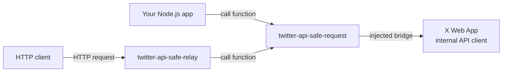

# twitter-api-safe-relay

A TypeScript monorepo for calling the internal Twitter/X Web App API client from a logged-in browser opened through Browser use.

This is not just another Node.js HTTP client. It opens X.com in a real browser, hooks into the Web App's webpack runtime, captures the internal API client used by the page, and dispatches requests from Node.js through the browser page bridge.

In other words, this project delegates requests to the logged-in browser context instead of reimplementing cookies, auth state, CSRF handling, Web App request behavior, feature flags, and other moving parts in Node.js.

## What makes it different?

This project finds the API client that the X/Twitter Web App uses inside the browser, hooks into it, and lets that client perform requests on your behalf.



The important part is that Node.js does not directly reimplement X's internal API behavior. Instead, requests are routed through the client extracted from the live X Web App, so they run in the same browser environment as the Web App itself.

## Setup

### Docker

The `Dockerfile` builds three images:

- **init-profile** — a one-shot job that prepares the shared browser profile volume (fixes permissions, clears stale Chrome lock files).
- **relay** — the HTTP relay server (`dist/server.js`).
- **dashboard** — the debug server with the web dashboard UI (`dist/debug/server.js`).

See `docker/` for the Docker Compose setup.

### Local

```sh
pnpm install
```

Install the Browser use-backed browser runtime if needed.

```sh
pnpm --filter twitter-api-safe-relay exec playwright install chromium
```

## Tests

Run the dashboard unit tests:

```sh
pnpm test:dashboard
```

The request and relay test scripts exercise browser-backed integration flows:

```sh
pnpm test:request
pnpm test:relay
```

## Configuration

Configure the relay server port, log level, and browser profiles in the workspace-level `settings.json`.

```json
{
  "port": 3000,
  "logLevel": "info",
  "profiles": [
    {
      "name": "account1",
      "browser": {
        "type": "browser-use",
        "userDataDir": "./../../user_data/account1",
        "headless": false
      }
    }
  ]
}
```

Each profile's `browser` supports these types:

- `browser-use` — launch and drive the browser through Browser use. Set `userDataDir` to persist the signed-in X/Twitter profile.
- `cdp` — legacy mode for connecting to an already-running browser over the Chrome DevTools Protocol via `cdpEndpoint`.
- `launch` — legacy mode for launching a persistent browser context.

## `twitter-api-safe-request` example

`twitter-api-safe-request` is published on npm:

https://www.npmjs.com/package/twitter-api-safe-request

```sh
pnpm add twitter-api-safe-request
```

```ts
import { createTwitterBrowser } from "twitter-api-safe-request";
import { launchBrowserUse } from "twitter-api-safe-relay";

const browser = await launchBrowserUse({
  userDataDir: "./user_data/account1",
  headless: false,
});
const page = await browser.newPage();
const client = createTwitterBrowser(page);
await client.inject();

await client.goto("https://x.com/home");

const result = await client.dispatch({
  method: "GET",
  path: "/2/users/me",
  params: {},
});
```
