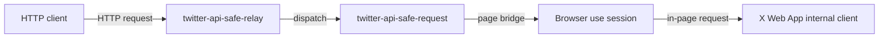

# twitter-api-safe-relay

Browser-use-backed relay for calling the internal Twitter/X Web App API client from a signed-in browser session.

This project opens X.com in a real browser, injects a small bridge into the Web App runtime, captures the internal request client used by the page, and forwards calls through that browser context. It avoids reimplementing cookies, CSRF handling, feature flags, and other Web App request details in Node.js.

This repository is based on `fa0311/twitter_api_safe_relay` and keeps the original MIT license.

## Packages

- `twitter-api-safe-relay` - Hono HTTP relay and debug dashboard server.
- `twitter-api-safe-request` - browser page bridge for dispatching X/Twitter Web App requests.
- `twitter-api-safe-dashboard` - debug dashboard UI.

## How It Works



## Setup

Install dependencies:

```sh
pnpm install
```

`browser-use` installs the required Chromium runtime during dependency installation. If you need to reinstall it manually:

```sh
pnpm --filter twitter-api-safe-relay exec playwright install chromium
```

## Configuration

Configure profiles in the workspace-level `settings.json`.

```json
{
  "port": 3000,
  "logLevel": "info",
  "profiles": [
    {
      "name": "account1",
      "browser": {
        "type": "browser-use",
        "userDataDir": "./../../user_data/account1",
        "headless": false,
        "viewport": { "width": 720, "height": 720 }
      }
    }
  ]
}
```

Browser modes:

- `browser-use` - launches and drives the browser through `browser-use`. Use `userDataDir` to persist the signed-in X/Twitter profile.
- `cdp` - legacy mode for connecting to an existing browser via Chrome DevTools Protocol.
- `launch` - legacy mode for launching a persistent Playwright context.

## Run

Relay server:

```sh
pnpm dev:relay
```

Debug dashboard server:

```sh
pnpm dev:relay:debug
```

By default, the server listens on `http://localhost:3000`.

## API Example

```ts
import { launchBrowserUse } from "twitter-api-safe-relay";
import { createTwitterBrowser } from "twitter-api-safe-request";

const browser = await launchBrowserUse({
  userDataDir: "./user_data/account1",
  headless: false,
});

const page = await browser.newPage();
const client = createTwitterBrowser(page);
await client.inject();
await client.goto("https://x.com/home");

const result = await client.dispatch({
  method: "GET",
  path: "/2/users/me",
  params: {},
});

console.log(result);
```

## Tests

```sh
pnpm type-check
pnpm build
pnpm test:dashboard
```

The request and relay tests exercise browser-backed integration flows and may require a usable signed-in browser profile:

```sh
pnpm test:request
pnpm test:relay
```

## Docker

The `Dockerfile` builds:

- `relay` - HTTP relay server.
- `dashboard` - debug server and dashboard.
- `init-profile` - helper image for preparing a shared browser profile volume.

See `docker/` for the Compose example.

## License

This project is released under the MIT License. See [LICENSE](./LICENSE).

Dependency license check was performed with:

```sh
pnpm licenses list --prod --json
```

The production dependency tree is primarily MIT-licensed, with additional permissive licenses including Apache-2.0, BSD-2-Clause, BSD-3-Clause, ISC, 0BSD, Unlicense, UPL-1.0 OR Apache-2.0, and similar permissive license expressions. No GPL-family production dependency license was reported by that command at the time of this check.

This is a dependency metadata check, not legal advice. Review dependency licenses yourself before redistributing packaged builds.

## Disclaimer

This project interacts with X/Twitter through a signed-in browser session and the Web App runtime. Use it only in ways that comply with applicable laws, platform terms, and account policies. The project is provided as-is without warranty.
